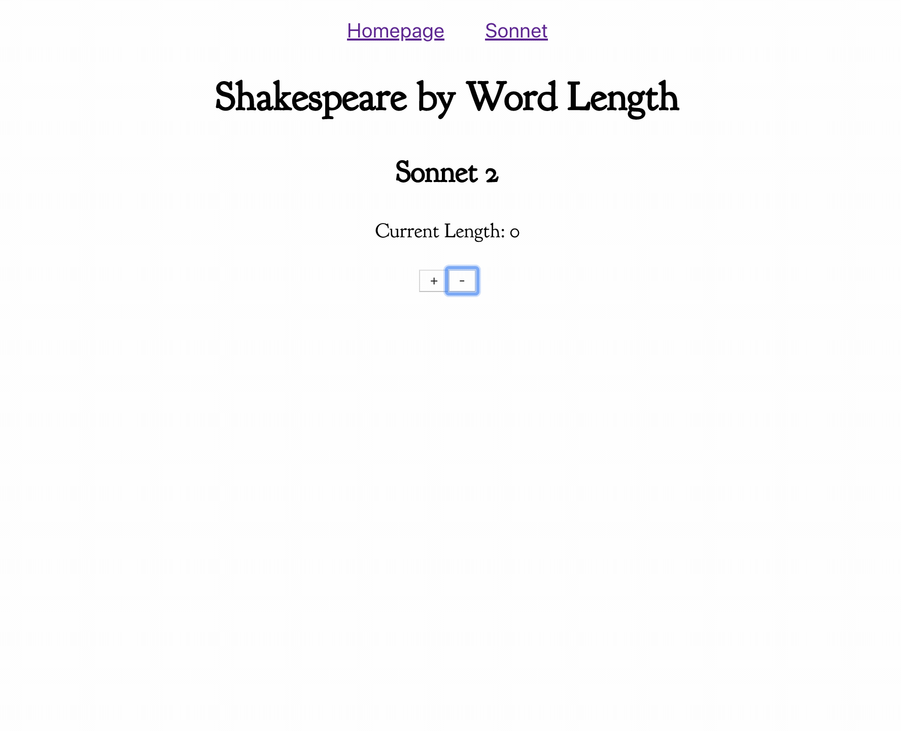

# Render Props Tutorial

## Challenge 1: Alternate Uses

Let's use our `<Tabs>` component to do something else. We've named it "Tabs", but really it's only doing two things:

- Giving us a number
- And a way to update that number

We can use this for much more than just rendering tabs (We'll cover that in the next challenge). In `Sonnet.js`, finish writing the `<Sonnet>` component to display only words of a certain length. It should look something like this when you are done:

Notes:

- Don't worry about how punctuation marks are included in the word length.
- Try to do this by working _only_ within the `<Sonnet>` component. (Feel free to break this into other files or components)

## Challenge 2: Refactor

We've found that we can use our `<Tabs>` component to do things other than rendering tabs. Also, we need to supply it with a `location`, `history`, and `initialTab` prop manually every time we use it. Let's make it all simpler and more flexible.

Steps:

1.  Rename the `<Tabs>` component, the `initialTab` prop and `currentTab`, `switchTab` render props to something that makes more sense. (I'm going to keep referring to them as 'tabs' in these instructions)
2.  Wrap the default export with `withRouter()` (see the comments in Tabs.js)
3.  Now that we don't need to supply this component with route info manually, remove the wrapping `<Route>` components that give it the `location`, `history`, and `initialTab` props. (In Homepage.js and Sonnet.js)
4.  Have the `<Tabs>` component determine the initial tab on its own, based on the location prop.
    - Hint: either handle this in the constructor, or make a function that you can pass some props to, i.e. `this.state = { currentTab: getCurrentTab(this.props) || 0 }`
5.  Add `increase` and `decrease` methods and provide them with the render props.
6.  Now that we have a simpler API, go back and change the implementation of `<Sonnet>`

**Test that you can still switch tabs between each step!!**

## Challenge 3: React Router Parameters and working with an API

Now that we have this working for one sonnet, let's make this a little more dynamic. First, [read up on how to use URL parameters with React Router](https://tylermcginnis.com/react-router-url-parameters/).

Next:

1. Change the `/sonnet` route to `/sonnets`, and have it display a list of sonnet titles.

- Fetch these titles at `https://sonnets-api.now.sh/api/sonnets/toc`
- Have each of these titles render a `<Link>` to `/sonnet/N`, where N is the number of that sonnet

2. Create a new route: `/sonnet/:number`. Using the URL param from react router, fetch and display that sonnet.

- Fetch sonnets at the endpoint `https://sonnets-api.now.sh/api/sonnets/{number}`

(the code for this API is at https://www.github.com/good-idea/sonnet-api in case you want to take a look at a simple express app!)

## Stretch Goals

- When determining the length of a word in the `<Sonnet>` component, **do not count punctuation marks**.
- Give a `min` and `max` prop to your (renamed!) `<Tabs>` component and ensure that the (renamed!) `currentTab` does not exceed them.
- Implement a 'Not Found' view
- Show a 'There is no sonnet with this number' view if someone goes to a sonnet page with a number that doesn't correspond with a sonnet.
